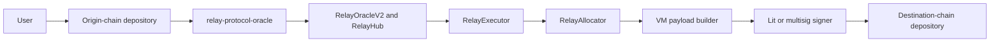

# Relay Settlement Protocol

The Relay Settlement Protocol is a multi-chain system for accounting for
deposits, settling orders, and authorizing withdrawals across heterogeneous
blockchains. This monorepo contains the Hub-chain smart contracts,
source- and destination-chain depository contracts, shared TypeScript tooling,
Lit signing actions, indexer applications, and price-feed ingesters.

Off-chain deposit observation, attestations, and environment configuration are
handled by
[`relay-protocol-oracle`](https://github.com/relayprotocol/relay-protocol-oracle).

## How it works



1. A user deposits into a depository on an origin chain. The deposit is bound
   to an order or another protocol action.
2. The oracle network observes the deposit and authorizes an action for
   `RelayOracleV2`, which updates the corresponding ERC-6909 balance in
   `RelayHub`.
3. `RelayExecutor` settles an order from its Hub balance. It can run solver
   conversion logic through an isolated call resolver and optionally draw
   bounded sponsorship or exact-output liquidity from funding pools.
4. `RelayAllocator` burns the Hub representation and delegates to the payload
   builder registered for the destination chain and depository.
5. The payload builder validates and encodes the withdrawal and produces the
   hashes that must be signed. Lit Actions or a multisig signer create the
   destination-chain signatures.
6. The signed payload executes against the destination depository, releasing
   funds to the withdrawal recipient.

See the [smart-contract documentation](./smart-contracts/README.md) for the
complete architecture, contract responsibilities, and interaction flows.

## Repository structure

| Directory                              | Purpose                                                                                                              |
| -------------------------------------- | -------------------------------------------------------------------------------------------------------------------- |
| [`smart-contracts`](./smart-contracts) | Solidity contracts for Hub accounting, oracle settlement, execution, allocation, payload construction, and pricing   |
| [`packages`](./packages)               | TypeScript libraries, applications, depository implementations, Lit Actions, signing tools, and shared configuration |
| [`crates`](./crates)                   | Rust services that ingest signed Chainlink, Pyth, RedStone, and Stork price updates for the oracle infrastructure    |
| [`docs`](./docs)                       | Protocol documentation and published security audit reports                                                          |

The [package index](./packages/README.md) and [crate index](./crates/README.md)
describe each package and service individually.

### Main components

| Component                                                                                               | Purpose                                                                                                                     |
| ------------------------------------------------------------------------------------------------------- | --------------------------------------------------------------------------------------------------------------------------- |
| [`RelayHub` and settlement contracts](./smart-contracts/README.md)                                      | Maintain cross-chain balances, apply oracle-authorized actions, execute orders, and allocate withdrawals                    |
| [`depository`](./packages/depository)                                                                   | Implements the Ethereum and Solana contracts that receive deposits and execute allocator-authorized withdrawals             |
| [`settlement-sdk`](./packages/sdk) and [`settlement-abis`](./packages/abis)                             | Provide shared protocol types, cross-VM codecs, and contract ABIs                                                           |
| [`settlement-networks`](./packages/networks)                                                            | Publishes supported-chain metadata and environment-specific contract addresses                                              |
| [`lit-allocator`](./packages/lit-allocator) and [`lit-deposit-address`](./packages/lit-deposit-address) | Derive protocol wallets, enforce transaction policies, and sign withdrawal or deposit-wallet transactions                   |
| [`multisig-tools`](./packages/multisig-tools)                                                           | Build, simulate, approve, submit, verify, and execute cross-VM multisig transactions                                        |
| [`indexer`](./packages/indexer) and [`indexer-ui`](./packages/indexer-ui)                               | Index settlement transfers, audit balances and coverage, expose an API, and provide an operational UI                       |
| [`crates`](./crates)                                                                                    | Supply provider-signed price payloads whose final verification is performed by the corresponding on-chain price adapter     |
| [`relay-protocol-oracle`](https://github.com/relayprotocol/relay-protocol-oracle)                     | Observes protocol events, produces attestations, and owns the environment configuration consumed by deployment verification |

## Development

The TypeScript and Solidity projects use Yarn 4 workspaces. Working across
those workspaces requires Node.js, Yarn, Foundry, and the repository's Git
submodules:

```sh
git submodule update --init --recursive
yarn install
```

Run the main workspace checks from the repository root:

```sh
yarn build
yarn test
yarn lint
```

These commands cover the root Yarn workspaces. The nested depository projects
use independent Foundry and Anchor setups and must be checked separately:

```sh
cd packages/depository/packages/ethereum-vm
forge build
forge test

cd ../solana-vm
anchor build
anchor test
```

The Solidity workspace also exposes targeted Foundry-backed commands:

```sh
cd smart-contracts
yarn build
yarn test
yarn coverage
```

`yarn coverage` reports production Solidity coverage only and fails when the
committed line, function, or branch threshold is not met.

The Rust price ingesters form a separate Cargo workspace:

```sh
cd crates
cargo build --workspace
cargo test --workspace
```

Deployment manifests and role or configuration wiring should be checked with
[`verify-deployment.ts`](./smart-contracts/deployments/scripts/misc/verify-deployment.ts)
as described in the [smart-contract README](./smart-contracts/README.md#deployments-and-verification).
