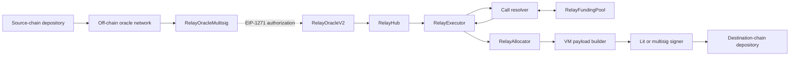

# Relay Settlement Smart Contracts

Solidity contracts for the Relay Settlement Protocol's hub-chain accounting,
oracle-authorized settlement, cross-chain withdrawals, deposit addresses,
pricing, and execution infrastructure.

The contracts use Solidity 0.8.28 and are built and tested with Foundry. They
are one part of a multi-chain system: source- and destination-chain depository
implementations live under [`packages/depository`](../packages/depository),
off-chain observation and attestation are handled by
[`relay-protocol-oracle`](https://github.com/relayprotocol/relay-protocol-oracle),
and encoders and shared types live in the [`settlement-sdk`](../packages/sdk).

## Architecture

The Hub chain is the protocol's accounting and coordination layer. Deposits on
supported chains are represented as balances in `RelayHub`; settlement consumes
those balances, optionally runs conversion or sponsorship logic, and turns the
result into a destination-specific withdrawal payload.



### Deposit and Hub accounting

1. A user deposits into a depository on an origin chain.
2. The off-chain oracle network observes the deposit and produces an
   authorization accepted through `RelayOracleMultisig`.
3. `RelayOracleV2` verifies the authorization and idempotency key, then applies
   its encoded `MINT`, `BURN`, `TRANSFER`, or `FAST_MINT` actions to `RelayHub`.
4. `RelayHub` records the cross-chain asset as an ERC-6909 token whose ID is
   derived from the origin chain slug and encoded currency. `ERC20View` exposes
   any Hub token through an ERC-20-compatible interface when integrations need
   one.

`FAST_MINT` makes funds available before slow finality. When configured by the
oracle authorization, it consumes budget through an allowlisted `IRateLimiter`
and may calculate a fee through an allowlisted `IFeeCalculator`.
`RelayOracleIdempotencyStore` preserves replay protection across oracle
versions.

### Order execution and withdrawal

1. Funds for an order sit at its virtual address in `RelayHub`.
2. Anyone may relay an oracle-signed request to `RelayExecutor`. The executor
   pulls the order balance, charges signed fees at most once, and transfers the
   net input to an `ICallResolver`.
3. The resolver runs the solver's conversion logic without inheriting the
   executor's Hub privileges. It must return at least the signed minimum output
   or the complete transaction reverts.
4. `RelayExecutor` moves the output to its allocator spender alias and submits
   a withdrawal request to `RelayAllocator`.
5. `RelayAllocator` burns the Hub representation, selects the payload builder
   registered for the destination chain and depository, and records the encoded
   payload plus the hashes that must be signed.
6. An off-chain signer signs those hashes. A submitter combines the payload and
   signatures and executes the withdrawal through the destination depository.

Call resolvers are intentionally separate from `RelayExecutor`. The generic
`BasicCallResolver` supports isolated arbitrary calls, while `PoolDrawResolver`
adds bounded sponsorship and exact-output funding from `RelayFundingPool`
accounts. Solver calls made during pool settlement run in `ResolverSandbox`,
which holds no pool roles.

### Payload configuration and gas payments

`RelayAllocator` maps each `(chainId, depository)` pair to an `IPayloadBuilder`.
Builders validate VM-specific addresses, currencies, transaction fields, and
policy before returning an unsigned payload and its signing digests.

Builders with environment-dependent settings read namespaced values from
`Config`, whose administrator always follows the current allocator owner.
When gas or another fee is spent from depository-held funds at withdrawal time,
`WithdrawGasPayer` uses an oracle authorization to burn the corresponding fee
from the spender's Hub balance before unlocking the matching payload build.
This keeps the accounting whole: the Hub's represented supply decreases by the
amount removed from depository reserves to pay the fee. Gateway, TON, and XRP
withdrawals use this mechanism.

### Deposit-address flow

`RelayDepositAddressManager` records an order trigger together with deterministic
derivation fields and prices returned by a selected `IPricingOracle`. The
off-chain oracle attests that trigger, and the Lit deposit-address actions verify
the attestation before deriving or signing with the matching deposit wallet.
See [`lit-deposit-address`](../packages/lit-deposit-address) for the derivation
and transaction-policy implementation.

### Pricing

`RelayPriceOracle` maps Hub currencies to provider feeds. It obtains the latest
signed update from `PriceOraclePrecompile`, delegates provider-specific
verification and decoding to an `IPriceFeedAdapter`, and enforces freshness and
monotonic publish times. The resulting prices are consumed by USD rate limits,
fast-mint fee calculation, and any deposit-address trigger configured to use
this oracle.

## Contract directory

### Core contracts

| Contract                                                                         | Purpose                                                                                                                                            |
| -------------------------------------------------------------------------------- | -------------------------------------------------------------------------------------------------------------------------------------------------- |
| [`RelayHub.sol`](./contracts/RelayHub.sol)                                       | ERC-6909 accounting ledger for assets deposited across chains; authorized operators mint, burn, and move balances                                  |
| [`ERC20View.sol`](./contracts/ERC20View.sol)                                     | ERC-20-compatible facade for one Hub token ID, forwarding balances, transfers, allowances, and metadata to `RelayHub`                              |
| [`RelayOracleV2.sol`](./contracts/RelayOracleV2.sol)                             | Verifies oracle-authorized action batches, enforces shared idempotency, and executes standard or rate-limited fast settlement against the Hub      |
| [`RelayOracleMultisig.sol`](./contracts/RelayOracleMultisig.sol)                 | Owner-managed threshold signer implementing EIP-1271 for oracle authorizations used by the oracle, executor, allocator, and related contracts      |
| [`RelayOracleIdempotencyStore.sol`](./contracts/RelayOracleIdempotencyStore.sol) | Shared replay-protection store that can also honor keys consumed by legacy oracle contracts                                                        |
| [`RelayExecutor.sol`](./contracts/RelayExecutor.sol)                             | Executes an oracle-signed order, charges fees, isolates solver calls in a resolver, checks minimum output, and initiates the allocator withdrawal  |
| [`RelayAllocator.sol`](./contracts/RelayAllocator.sol)                           | Burns Hub balances for withdrawals, selects the destination payload builder, and records payloads and signing hashes                               |
| [`Config.sol`](./contracts/Config.sol)                                           | Generic `bytes32` configuration store administered by the current owner of its configured allocator                                                |
| [`WithdrawGasPayer.sol`](./contracts/WithdrawGasPayer.sol)                       | Burns oracle-authorized withdrawal fees from Hub balances when matching fees are spent from depository reserves, keeping protocol accounting whole |
| [`RelayPriceOracle.sol`](./contracts/RelayPriceOracle.sol)                       | Routes currencies to provider feeds, verifies updates through adapters, and exposes normalized USD and bid/ask prices                              |
| [`RelayGenericMapping.sol`](./contracts/RelayGenericMapping.sol)                 | Replay-protected per-user data store whose set and delete operations require an authorized oracle signature                                        |
| [`RelayMultisigSigner.sol`](./contracts/RelayMultisigSigner.sol)                 | Safe-owned Aurora contract that approves messages and requests ECDSA or EdDSA signatures from NEAR Chain Signatures                                |
| [`ChainSignatures.sol`](./contracts/ChainSignatures.sol)                         | Encodes JSON requests and byte strings for the NEAR Chain Signatures service                                                                       |
| [`Utils.sol`](./contracts/Utils.sol)                                             | Shared token-ID, virtual-address, EIP-712, and endian-encoding helpers                                                                             |

### `call-resolvers/`

Call resolvers receive only the current order's input from `RelayExecutor` and
return its output without receiving the executor's Hub operator privileges.

| Contract                                                                    | Purpose                                                                                                         |
| --------------------------------------------------------------------------- | --------------------------------------------------------------------------------------------------------------- |
| [`ICallResolver.sol`](./contracts/call-resolvers/ICallResolver.sol)         | Defines the oracle-signed execute-and-withdraw request and the resolver interface                               |
| [`BasicCallResolver.sol`](./contracts/call-resolvers/BasicCallResolver.sol) | Reference resolver that executes arbitrary calls and sweeps selected Hub token balances to specified recipients |
| [`PoolDrawResolver.sol`](./contracts/call-resolvers/PoolDrawResolver.sol)   | Settles ordered fixed or shortfall draw legs against funding-pool accounts around the solver's request calls    |
| [`PoolResolverBase.sol`](./contracts/call-resolvers/PoolResolverBase.sol)   | Shared trusted mechanics for payload commitments, pool debits and credits, token conversion, and final sweeps   |
| [`ResolverSandbox.sol`](./contracts/call-resolvers/ResolverSandbox.sol)     | Unprivileged, resolver-owned executor for solver calls; it cannot invoke role-gated pool debits                 |

### `deposit-addresses/`

| Contract                                                                                         | Purpose                                                                                                                        |
| ------------------------------------------------------------------------------------------------ | ------------------------------------------------------------------------------------------------------------------------------ |
| [`RelayDepositAddressManager.sol`](./contracts/deposit-addresses/RelayDepositAddressManager.sol) | Records uniquely identified deposit-address triggers binding order inputs, derivation fields, prices, and oracle-specific data |
| [`oracle/IPricingOracle.sol`](./contracts/deposit-addresses/oracle/IPricingOracle.sol)           | Defines cross-chain currency, mid-price, and bid/ask types plus pricing-oracle interfaces                                      |
| [`oracle/BasicPricingOracle.sol`](./contracts/deposit-addresses/oracle/BasicPricingOracle.sol)   | Minimal implementation that decodes caller-supplied prices directly from `extraData`                                           |
| [`oracle/SignedPricingOracle.sol`](./contracts/deposit-addresses/oracle/SignedPricingOracle.sol) | Verifies expiring EIP-712 prices from the solver address fixed at deployment                                                   |

### `fee-calculators/`

| Contract                                                                             | Purpose                                                                                                |
| ------------------------------------------------------------------------------------ | ------------------------------------------------------------------------------------------------------ |
| [`IFeeCalculator.sol`](./contracts/fee-calculators/IFeeCalculator.sol)               | Pluggable interface for calculating a `FAST_MINT` fee, its currency, payer, and recipient              |
| [`RelayBpsFeeCalculator.sol`](./contracts/fee-calculators/RelayBpsFeeCalculator.sol) | Converts a configured fraction of deposit USD value into a capped amount of the requested fee currency |

### `funding-pools/`

Funding pools custody ordinary ERC-20s or Hub assets through their `ERC20View`
contracts. Balances are attributed per account; each account independently
sets resolver allowlists, per-order caps, budgets, expirations, and an
authorizer for individual orders.

| Contract                                                                               | Purpose                                                                                                                      |
| -------------------------------------------------------------------------------------- | ---------------------------------------------------------------------------------------------------------------------------- |
| [`IRelayFundingPool.sol`](./contracts/funding-pools/IRelayFundingPool.sol)             | Defines pool balances, draw modes, standing sponsorship configuration, signed updates, withdrawals, and order authorizations |
| [`RelayFundingPool.sol`](./contracts/funding-pools/RelayFundingPool.sol)               | Holds per-account token balances and permits bounded, replay-safe resolver draws plus signed or role-gated withdrawals       |
| [`RelayFundingPoolFactory.sol`](./contracts/funding-pools/RelayFundingPoolFactory.sol) | Deterministically deploys full funding-pool contracts with `CREATE2` and tracks pools it created                             |

### `payload-builders/`

All primary builders implement `IPayloadBuilder`, returning an encoded payload,
the hashes to sign, a signing curve, and a VM family name.

| Contract                                                                                          | Purpose                                                                                                                        |
| ------------------------------------------------------------------------------------------------- | ------------------------------------------------------------------------------------------------------------------------------ |
| [`BitcoinVmPayloadBuilder.sol`](./contracts/payload-builders/BitcoinVmPayloadBuilder.sol)         | Builds P2WPKH Bitcoin withdrawals, including allocator and fee UTXOs, change, an order identifier, and BIP-143 signing digests |
| [`EthereumVmPayloadBuilder.sol`](./contracts/payload-builders/EthereumVmPayloadBuilder.sol)       | Builds EIP-712 EVM depository call requests, including versioned routed withdrawals through allowlisted routers                |
| [`TronVmPayloadBuilder.sol`](./contracts/payload-builders/TronVmPayloadBuilder.sol)               | Builds Tron depository call requests using Tron address validation and EIP-712-compatible signing data                         |
| [`SolanaVmPayloadBuilder.sol`](./contracts/payload-builders/SolanaVmPayloadBuilder.sol)           | Builds Solana depository transfer instructions from configured domains, vaults, and expiration policy                          |
| [`TonVmPayloadBuilder.sol`](./contracts/payload-builders/TonVmPayloadBuilder.sol)                 | Builds native TON transfers for Highload Wallet V3 and requires a sufficient recorded gas payment                              |
| [`XrpVmPayloadBuilder.sol`](./contracts/payload-builders/XrpVmPayloadBuilder.sol)                 | Builds native-XRP payment transactions for a fixed signing public key and requires a recorded gas payment                      |
| [`HederaVmPayloadBuilder.sol`](./contracts/payload-builders/HederaVmPayloadBuilder.sol)           | Builds direct Hedera `CryptoTransfer` transactions for HBAR or one configured HTS token, with submitter-paid fees              |
| [`HyperliquidVmPayloadBuilder.sol`](./contracts/payload-builders/HyperliquidVmPayloadBuilder.sol) | Builds Hyperliquid `usdSend` and `sendAsset` actions using configured symbols, decimals, and DEX routing                       |
| [`LighterVmPayloadBuilder.sol`](./contracts/payload-builders/LighterVmPayloadBuilder.sol)         | Builds Lighter transfer actions using configured account route types and asset indexes                                         |
| [`GatewayVmPayloadBuilder.sol`](./contracts/payload-builders/GatewayVmPayloadBuilder.sol)         | Builds Circle Gateway burn intents and delegates the destination execution payload to a VM-specific builder                    |
| [`GasPaidPayloadBuilder.sol`](./contracts/payload-builders/GasPaidPayloadBuilder.sol)             | Shared mixin and hashing helpers for builders that require a matching `WithdrawGasPayer` record                                |

The Gateway subdirectory contains the destination abstraction and Circle wire
format used by `GatewayVmPayloadBuilder`:

| Contract                                                                                                                                        | Purpose                                                                                                  |
| ----------------------------------------------------------------------------------------------------------------------------------------------- | -------------------------------------------------------------------------------------------------------- |
| [`gateway/IGatewayDestinationPayloadBuilder.sol`](./contracts/payload-builders/gateway/IGatewayDestinationPayloadBuilder.sol)                   | Interface for adapting a Gateway withdrawal to one destination VM's execution payload and signing digest |
| [`gateway/GatewayEthereumVmDestinationPayloadBuilder.sol`](./contracts/payload-builders/gateway/GatewayEthereumVmDestinationPayloadBuilder.sol) | Builds EVM Gateway execution requests, including routed call commitments                                 |
| [`gateway/CircleGatewayTypes.sol`](./contracts/payload-builders/gateway/CircleGatewayTypes.sol)                                                 | Shared Circle `TransferSpec` and `BurnIntent` structures                                                 |
| [`gateway/CircleGatewayCodec.sol`](./contracts/payload-builders/gateway/CircleGatewayCodec.sol)                                                 | Encodes Circle Gateway wire data and EIP-712 hashes                                                      |

Payload serialization helpers:

| Contract                                                                | Purpose                                                                         |
| ----------------------------------------------------------------------- | ------------------------------------------------------------------------------- |
| [`utils/Protobuf.sol`](./contracts/payload-builders/utils/Protobuf.sol) | Minimal protobuf writer used to serialize Hedera transaction messages           |
| [`utils/Sha512.sol`](./contracts/payload-builders/utils/Sha512.sol)     | Pure-Solidity SHA-512 implementation used to compute XRP Ledger signing digests |

### `price-adapters/` and `precompiles/`

| Contract                                                                                        | Purpose                                                                                                                        |
| ----------------------------------------------------------------------------------------------- | ------------------------------------------------------------------------------------------------------------------------------ |
| [`PriceOraclePrecompile.sol`](./contracts/precompiles/PriceOraclePrecompile.sol)                | Wrapper for reading the latest raw signed provider update from the Relay price-oracle precompile                               |
| [`ChainlinkDataStreamsAdapter.sol`](./contracts/price-adapters/ChainlinkDataStreamsAdapter.sol) | Verifies Chainlink Data Streams V3 reports through its verifier proxy and returns normalized mid, bid, ask, and timestamp data |
| [`StorkFastAdapter.sol`](./contracts/price-adapters/StorkFastAdapter.sol)                       | Verifies Stork Fast signed batches, derives feed IDs, and returns monotonic normalized prices                                  |

### `rate-limiters/`

| Contract                                                                             | Purpose                                                                                                |
| ------------------------------------------------------------------------------------ | ------------------------------------------------------------------------------------------------------ |
| [`IRateLimiter.sol`](./contracts/rate-limiters/IRateLimiter.sol)                     | Pluggable, fail-closed budget interface consulted by `RelayOracleV2` for `FAST_MINT`                   |
| [`RelayAmountRateLimiter.sol`](./contracts/rate-limiters/RelayAmountRateLimiter.sol) | Token-bucket limiter denominated in each Hub token's native base units                                 |
| [`RelayUsdRateLimiter.sol`](./contracts/rate-limiters/RelayUsdRateLimiter.sol)       | Per-chain token-bucket limiter that uses `RelayPriceOracle` to consume a shared USD-denominated budget |

### `routers/`

Routers run on destination chains. EVM payload builders can commit to a router
and call bundle, while the destination depository controls which routers may be
invoked.

| Contract                                                           | Purpose                                                                                                                        |
| ------------------------------------------------------------------ | ------------------------------------------------------------------------------------------------------------------------------ |
| [`IMulticallRouter.sol`](./contracts/routers/IMulticallRouter.sol) | Defines the standard destination multicall structure and interface                                                             |
| [`MulticallRouter.sol`](./contracts/routers/MulticallRouter.sol)   | Executes depository-authorized calls and provides self-call-only settlement and sweep helpers with minimum-balance enforcement |

### `aurora-xcc/`

These libraries support `RelayMultisigSigner` when it calls the NEAR Chain
Signatures service from Aurora.

| Contract                                                          | Purpose                                                                                    |
| ----------------------------------------------------------------- | ------------------------------------------------------------------------------------------ |
| [`AuroraSdk.sol`](./contracts/aurora-xcc/AuroraSdk.sol)           | High-level wrapper for Aurora-to-NEAR cross-contract calls, callbacks, and promise results |
| [`AuroraXccUtils.sol`](./contracts/aurora-xcc/AuroraXccUtils.sol) | Low-level endian, memory, hashing, and hexadecimal helpers used by the XCC codecs          |
| [`Borsh.sol`](./contracts/aurora-xcc/Borsh.sol)                   | Borsh serialization primitives for NEAR promise data                                       |
| [`Codec.sol`](./contracts/aurora-xcc/Codec.sol)                   | Encodes the XCC promise types into Borsh payloads                                          |
| [`Types.sol`](./contracts/aurora-xcc/Types.sol)                   | Shared promise, callback, execution-mode, and result structures                            |

### Test support

`mocks/` contains dependency doubles and harnesses used by unit tests:

| Contract                                                                             | Purpose                                                                          |
| ------------------------------------------------------------------------------------ | -------------------------------------------------------------------------------- |
| [`EmptyPayloadBuilder.sol`](./contracts/mocks/EmptyPayloadBuilder.sol)               | Payload builder that always returns an empty payload for allocator failure tests |
| [`MockPriceFeedAdapter.sol`](./contracts/mocks/MockPriceFeedAdapter.sol)             | Adapter that decodes ABI-encoded price updates without an external provider      |
| [`MockPricingOracle.sol`](./contracts/mocks/MockPricingOracle.sol)                   | Mutable caller-controlled `IPricingOracle` implementation                        |
| [`MockStorkFastVerifier.sol`](./contracts/mocks/MockStorkFastVerifier.sol)           | Test double for Stork Fast payload verification and decoding                     |
| [`MockVerifierProxy.sol`](./contracts/mocks/MockVerifierProxy.sol)                   | Test double for Chainlink's Data Streams verifier proxy                          |
| [`MockWNEAR.sol`](./contracts/mocks/MockWNEAR.sol)                                   | Mintable wrapped-NEAR token used by multisig signer tests                        |
| [`RelayMultisigSignerHarness.sol`](./contracts/mocks/RelayMultisigSignerHarness.sol) | Harness exposing multisig signer behavior needed by tests                        |

`test-utils/` contains reusable test tokens:

| Contract                                                                  | Purpose                                                                  |
| ------------------------------------------------------------------------- | ------------------------------------------------------------------------ |
| [`FeeOnTransferToken.sol`](./contracts/test-utils/FeeOnTransferToken.sol) | ERC-20 that burns a fixed transfer fee for funding-pool accounting tests |
| [`MyToken.sol`](./contracts/test-utils/MyToken.sol)                       | Mintable ERC-20 with permit support used across contract tests           |

## Repository layout

| Directory                                           | Purpose                                                                              |
| --------------------------------------------------- | ------------------------------------------------------------------------------------ |
| [`contracts/`](./contracts)                         | Production contracts, interfaces, libraries, mocks, and test helpers described above |
| [`script/`](./script)                               | Foundry deployment and role-management scripts                                       |
| [`deployments/contracts/`](./deployments/contracts) | Environment deployment manifests for `dev`, `stag`, `test`, and `prod`               |
| [`deployments/scripts/`](./deployments/scripts)     | Configuration, funding, verification, and Safe deployment utilities                  |
| [`test/`](./test)                                   | Foundry unit, fuzz, and integration tests grouped by contract                        |
| [`tools/`](./tools)                                 | ABI export, ABI versioning, and dependency-linking utilities                         |

## Development

Install dependencies from the monorepo root, then run contract commands from
this directory:

```sh
yarn build
yarn test
yarn lint
yarn coverage
```

- `yarn build` compiles the contracts with Foundry
- `yarn test` runs the Foundry test suite
- `yarn lint` runs Solhint
- `yarn coverage` instruments the contracts with Foundry's coverage-specific
  IR mode, writes `out/lcov.info`, and enforces the production thresholds in
  [`tools/coverage-thresholds.json`](./tools/coverage-thresholds.json)

Coverage includes production sources under `contracts/`, including the linked
EVM depository sources. Tests, deployment scripts, mocks, and test tokens are
excluded from both the reported totals and the threshold gate. The IR mode is
required because the unoptimized coverage build exceeds the Solidity stack
limit in some contracts; Foundry may print its standard source-mapping warning
for this mode.

Generated `artifacts/`, `cache/`, and `out/` directories must not be edited
manually.

## Deployments and verification

Foundry deployment scripts live under [`script/`](./script), with Yarn wrappers
listed in [`package.json`](./package.json). Deployed addresses are recorded by
environment under [`deployments/contracts/`](./deployments/contracts). Network
metadata and published contract addresses belong in the
[`settlement-networks`](../packages/networks) package.

After deploying or changing configuration, use
[`verify-deployment.ts`](./deployments/scripts/misc/verify-deployment.ts) as the
canonical deployment audit instead of maintaining manual role and config
checklists in this README:

```sh
yarn ts-node deployments/scripts/misc/verify-deployment.ts \
  deployments/contracts/stag.json
```

The verifier checks:

- deployment addresses against the oracle Hub configuration
- immutable links between the Hub, oracle, executor, allocator, config, gas
  payer, resolvers, and payload builders
- expected AccessControl role holders and unexpected holders discovered from
  `RoleGranted` logs
- oracle idempotency-store sources and writer permissions
- funding-pool factory, resolver, and role wiring
- allocator payload-builder registrations for configured chains
- required global, per-chain, and per-currency payload-builder config values
- Gateway domains, tokens, routing, depository, gas fee, and allocator policy
- EVM, Tron, and Solana depository owner/allocator state on their own chains

By default the script resolves environment-specific oracle configs and RPCs.
Use `RELAY_RPC_URL`, `ORACLE_CONFIG_PATH`, or `CHAINS_CONFIG` to override those
sources, `TESTNETS=1` for testnet oracle configs, and `--print-cast` to print
remediation commands for missing role grants. The script is read-only unless a
printed command is explicitly executed separately.

Transaction-manifest generation, simulation, Safe submission, verification,
and execution for `RelayMultisigSigner` are documented in
[`@relay-settlement/multisig-tools`](../packages/multisig-tools/README.md).
