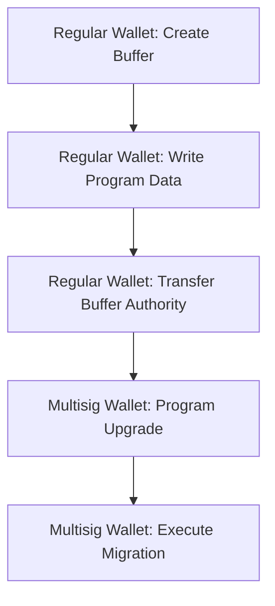

# Solana Multisig Program Upgrade Demo

## Overview

This demo **validates the technical feasibility** of using Relay Multisig Signer for Solana contract upgrades by solving the fundamental scalability challenge. The key innovation is a two-wallet architecture:

1. **Regular Wallet (Buffer Authority)** - Executes hundreds of buffer write transactions (no multisig needed)
2. **Multisig Wallet (Upgrade Authority)** - Signs only the final upgrade transaction (single multisig approval)

This approach **proves that we can confidently transfer ownership** of Solana contracts to the relay multisig signer without operational bottlenecks.

## Problem Statement

### Original Challenge

Solana contract upgrades require hundreds of write transactions due to transaction size limits. This creates a scalability problem for multisig signers:

- **Buffer Account Creation**: Requires chunked write operations
- **Program Data Writing**: Hundreds of transactions needed
- **Multisig Bottleneck**: Each transaction needs multiple signatures
- **Operational Complexity**: Coordinating hundreds of multisig approvals

### Solution Approach

Introduce a **two-wallet architecture** to solve the scalability challenge:

- **Regular Wallet**: Handles buffer creation and batch write operations (no multisig needed)
- **Multisig Wallet**: Only signs the final upgrade transaction (single multisig approval)
- **Authority Transfer**: Seamlessly transfers control between wallets at the right moment

## Workflow



## Demo Scenario

Using RelayDepository contract's real business logic upgrade for testing:

- **Initial Version**: No domain_separator field
- **Upgrade Version**: Adds domain_separator field
- **Migration Function**: `migrate_domain_separator` implements account reallocation

## Practical Operation Demo

### 1. Account Preparation

```bash
# Generate regular wallet (Buffer Authority)
solana-keygen new -o buffer-authority-keypair.json

# Prepare multisig wallet (Upgrade Authority)
# Using fixed MOCK_OWNER as example
```

### 2. Execute Complete Upgrade Flow

```bash
npx hardhat relay-multisig-signer:solana-upgrade-with-migration \
    --rpc "http://127.0.0.1:8899" \
    --initial-program-path "tasks/relayMultisigSigner/solana/programs/relay_depository-v1.so" \
    --upgrade-program-path "tasks/relayMultisigSigner/solana/programs/relay_depository-v2.so" \
    --program-keypair "tasks/relayMultisigSigner/solana/programs/relay_depository-keypair.json" \
    --auto-create
```

### 3. Key Steps Breakdown

#### Phase 1: Buffer Operations (Regular Wallet)

```
📝 Creating initial buffer account...
✅ Buffer account created: [signature]
📝 Writing initial program data to buffer...
✅ All program data written to buffer successfully!
🔄 Transferring buffer authority to upgrade authority...
✅ Buffer authority transferred
```

#### Phase 2: Program Upgrade (Multisig Wallet)

```
📝 Deploying/upgrading program...
✅ Program deployed/upgraded: [signature]
```

#### Phase 3: Migration Execution (Multisig Wallet)

```
🔄 Calling migrate_domain_separator...
📊 Pre-migration account size: 73 bytes
📊 Post-migration account size: 106 bytes
📊 Size change: +33 bytes
✅ Domain separator migration completed
```

## Multisig Transaction Generation

### SolanaTxSchema Structure

Based on existing transaction architecture, upgrade transaction structure:

```json
{
  "family": "solana-vm",
  "from": "multisig_wallet_address",
  "rpc": "https://api.mainnet-beta.solana.com",
  "nonceAccount": "durable_nonce_account",
  "nonceAccountAuth": "multisig_wallet_address",
  "computeUnitLimit": "300000",
  "computeUnitPrice": "5000",
  "instructions": [
    {
      "programId": "BPFLoaderUpgradeab1e11111111111111111111111",
      "data": "upgrade_instruction_data_hex",
      "keys": [
        {
          "pubkey": "program_account",
          "isSigner": false,
          "isWritable": true
        },
        {
          "pubkey": "buffer_account",
          "isSigner": false,
          "isWritable": true
        },
        {
          "pubkey": "upgrade_authority",
          "isSigner": true,
          "isWritable": false
        },
        {
          "pubkey": "spill_account",
          "isSigner": false,
          "isWritable": true
        }
      ]
    }
  ]
}
```

### Migration Transaction Structure

```json
{
  "family": "solana-vm",
  "from": "multisig_wallet_address",
  "rpc": "https://api.mainnet-beta.solana.com",
  "instructions": [
    {
      "programId": "program_id",
      "data": "migrate_domain_separator_instruction_data",
      "keys": [
        {
          "pubkey": "relay_depository_pda",
          "isSigner": false,
          "isWritable": true
        },
        {
          "pubkey": "owner_account",
          "isSigner": true,
          "isWritable": true
        },
        {
          "pubkey": "11111111111111111111111111111112",
          "isSigner": false,
          "isWritable": false
        }
      ]
    }
  ]
}
```

## Future Development Tasks

### 1. Script to Generate Multisig Upgrade Transactions

Create script to automatically generate upgrade transactions conforming to SolanaTxSchema:

```typescript
// generateUpgradeTransaction.ts
export function generateUpgradeTransaction(
  programId: string,
  bufferAccount: string,
  upgradeAuthority: string,
  spillAccount: string
): SolanaTxSchema {
  // Implementation logic for transaction generation
}
```

### 2. Batch Buffer Write Task

Create task for batch writing contracts to buffer accounts:

```typescript
// task: relay-multisig-signer:solana-batch-buffer-write
task("relay-multisig-signer:solana-batch-buffer-write")
  .addParam("programPath", "Path to .so file")
  .addParam("bufferAuthority", "Buffer authority private key")
  .setAction(async ({ programPath, bufferAuthority }) => {
    // Implementation logic for batch writing
  })
```

### 3. Complete Multisig Upgrade Pipeline

```bash
# Step 1: Regular wallet batch write
npx hardhat relay-multisig-signer:solana-batch-buffer-write \
  --program-path "./target/deploy/program.so" \
  --buffer-authority "regular_wallet_private_key"

# Step 2: Generate multisig upgrade transaction
npx hardhat relay-multisig-signer:solana-generate-upgrade-tx \
  --buffer-account "buffer_address" \
  --program-id "program_address" \
  --upgrade-authority "multisig_wallet_address"

# Step 3: Multisig wallet signs and executes
npx hardhat relay-multisig-signer:execute \
  --transaction-file "./upgrade-transaction.json"
```

## Technical Details

### Buffer Account Management

- **Creation**: Regular wallet creates and pays rent
- **Writing**: Regular wallet chunks program data writes
- **Transfer**: Regular wallet transfers authority to multisig wallet

### Permission Separation

- **Buffer Authority**: Controls buffer creation and writing
- **Upgrade Authority**: Controls program upgrades and migration
- **Owner**: Controls program business logic operations

### Security Considerations

- Buffer writing with regular wallet doesn't affect security
- Critical upgrade operations still require multisig confirmation
- Program ID and upgrade permissions controlled by multisig wallet
